# 🧑🏻‍💻Lucas Nascimento

**`Student`** **`Indie Developer`**

I'm Lucas da Silva Nascimento, a 22-year-old Computer Science student at ULBRA Palmas with a strong passion for programming logic and game development. I enjoy solving problems, learning new technologies, and building creative solutions through code. In my free time, I explore my artistic side by creating pixel art, which you can find on my Instagram: <a href="https://www.instagram.com/lunastik_art/">@lunastik_art</a>.

 

## ⚙️ Technologies

## 📊 Metrics

